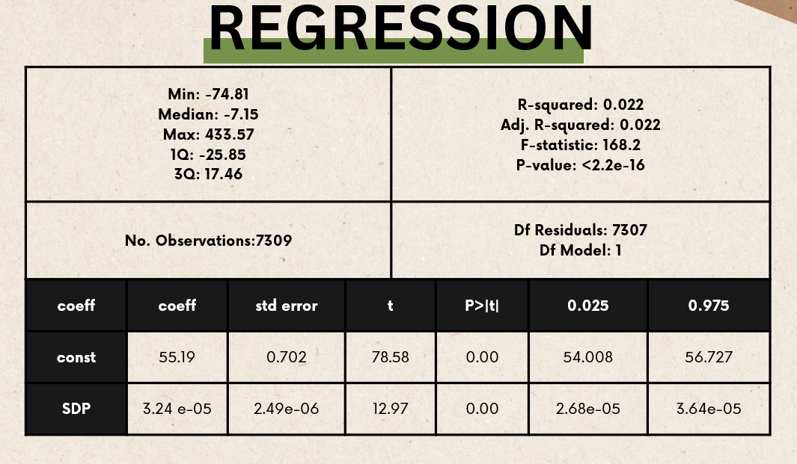
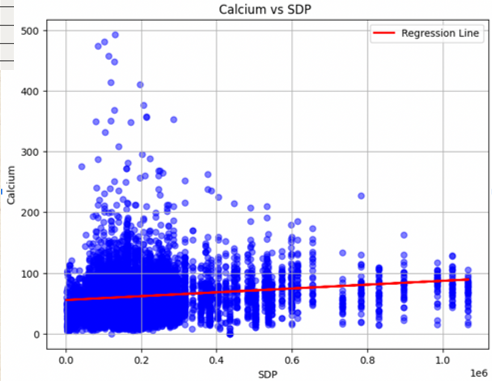
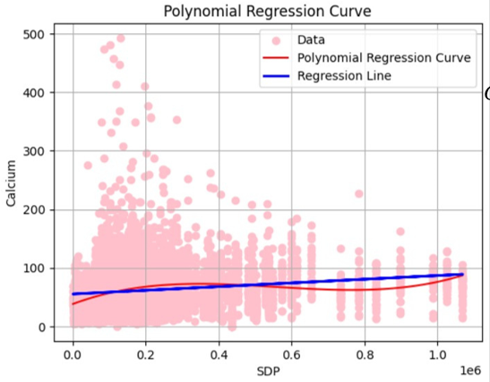
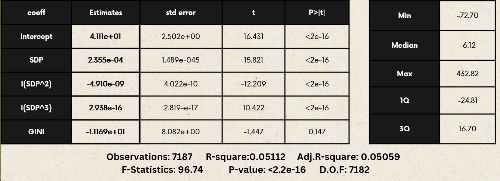

# Groundwater Pollution Econometric Analysis

## Project Overview
This project aims to investigate the relationship between groundwater quality, specifically calcium concentration, and economic factors such as the State Domestic Product (SDP) and the Gini coefficient (a measure of income inequality). By leveraging machine learning techniques, we aim to model and predict how economic growth and income distribution influence groundwater pollution across various districts and states over time.

## Presentation
For a detailed overview of this project, please refer to the [project presentation](https://docs.google.com/presentation/d/1uhLWvioX_ZIaZJowFVLfwMpoPeLaRmSo/edit?usp=drive_link&ouid=112097443858963891006&rtpof=true&sd=true).

## Table of Contents
1. [Introduction](#introduction)
2. [Data Collection and Preprocessing](#data-collection-and-preprocessing)
3. [Model Specification](#model-specification)
4. [Regression Analysis](#regression-analysis)
5. [Results and Discussion](#results-and-discussion)
6. [Plots and Visualizations](#plots-and-visualizations)
7. [Conclusion](#conclusion)
8. [Future Work](#future-work)
9. [References](#references)

## Introduction
Groundwater pollution, particularly from calcium, is a significant environmental and public health concern. The presence of chemical elements in water can vary, and their concentration levels can impact human health. This project examines how economic activities, reflected by SDP, and income inequality, represented by the Gini coefficient, affect groundwater quality over time.

## Data Collection and Preprocessing
### Data Sources
- **Groundwater Quality Data**: Contains calcium concentration levels in groundwater for various districts over several years.
- **Economic Data**: Includes the State Domestic Product (SDP) and Gini coefficient for different states and districts.

### Data Merging
- Merged the groundwater quality data with economic data using district and year as keys.
- Handled missing values under the assumption of Missing Completely At Random (MCAR).
- Addressed cases where districts were subdivided by assigning Gini index values of the parent districts to newly formed districts.

### Assumptions
- The missingness in the data is random and does not bias the results.
- The SDP of a state adequately represents the economic activity of its constituent districts.

## Model Specification

The primary regression model used in this analysis is:

\[ \text{GWQ}_{it} = \beta_0 + \beta_1 \text{SDP}_{it} + \beta_2 \text{SDP}_{it}^2 + \beta_3 \text{SDP}_{it}^3 + \beta_4 \text{Gini}_{it} + \epsilon_{it} \]

Where:
- \( \text{GWQ}_{it} \): Groundwater quality (calcium concentration) in district \( i \) at time \( t \).
- \( \text{SDP}_{it} \): State Domestic Product of district \( i \) at time \( t \).
- \( \text{Gini}_{it} \): Gini coefficient of district \( i \) at time \( t \).
- \( \epsilon_{it} \): Random error term.

## Regression Analysis
### Initial Regression
The initial model considered a simple linear relationship between SDP and groundwater quality:

$$
\text{GWQ}_{it} = \beta_0 + \beta_1 \text{SDP}_{it} + \epsilon_{it}
$$

Results indicated a statistically significant but weak relationship, with a low R-squared value suggesting other factors influencing groundwater quality were not included in the model.

### Extended Model
To capture potential non-linearities and improve model fit, we included higher-order terms of SDP:

$$
\text{GWQ}_{it} = \beta_0 + \beta_1 \text{SDP}_{it} + \beta_2 \text{SDP}_{it}^2 + \beta_3 \text{SDP}_{it}^3 +  + \beta_4 \text{Gini}_{it}+\epsilon_{it}
$$

The inclusion of quadratic and cubic terms for SDP improved the model's explanatory power and revealed an inverted U-shaped relationship consistent with the Environmental Kuznets Curve hypothesis.

## Results and Discussion
### Key Findings
- **Positive Relationship**: Initial findings indicated a positive relationship between SDP and groundwater calcium concentration.
- **Non-linear Relationship**: Further analysis revealed a non-linear, inverted U-shaped relationship, suggesting that beyond a certain point, economic growth may lead to improved groundwater quality due to better environmental practices and regulations.
- **Income Inequality**: The Gini coefficient showed a negative relationship with groundwater quality, implying that higher income inequality is associated with poorer groundwater quality.

### Statistical Significance
- Low p-values for the coefficients of SDP, SDP^2, and SDP^3 confirmed their statistical significance.
- The overall model was significant, as indicated by the F-statistic.

## Conclusion
The analysis confirmed that economic development and income inequality significantly impact groundwater quality. The non-linear relationship between SDP and groundwater pollution aligns with the Environmental Kuznets Curve hypothesis, suggesting that while initial economic growth may degrade groundwater quality, further growth can lead to improvements.

## Future Work
- **Incorporate More Variables**: Include other potential predictors of groundwater quality, such as industrial activity, agricultural practices, and regulatory measures.

